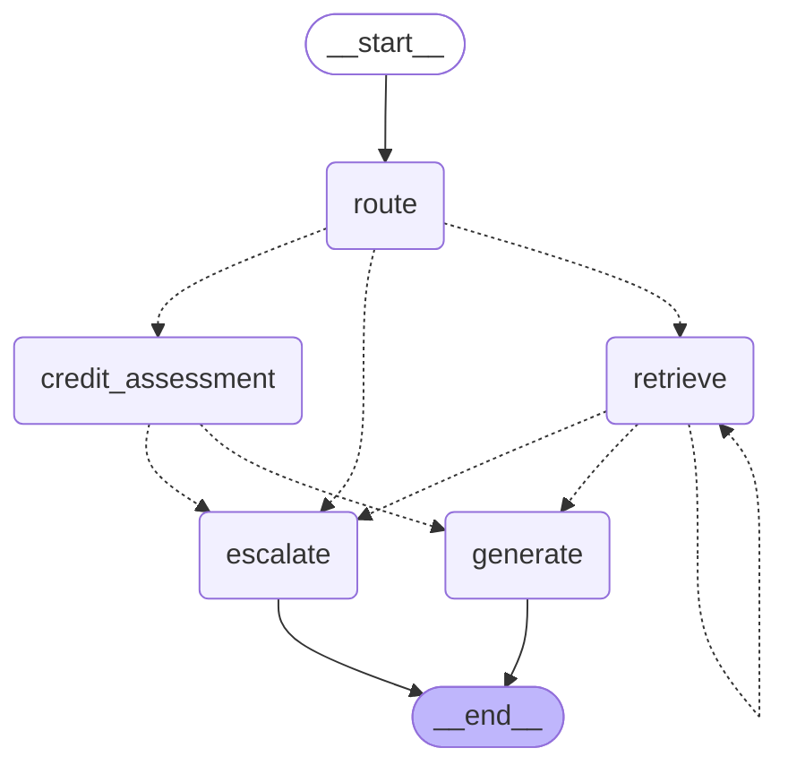

# LangGraph state machine

This diagram is generated directly from the compiled graph
(`agent.graph.build_graph().get_graph().draw_mermaid()`), not hand-drawn — it
is guaranteed to match `agent/graph.py`'s actual nodes and edges. Regenerate
it with:

```bash
python -c "from agent.graph import build_graph; print(build_graph().get_graph().draw_mermaid())"
```



Dotted edges are conditional (`add_conditional_edges`); solid edges are
unconditional (`add_edge`).

- **`route`** → `credit_assessment` (credit query) | `retrieve` (policy
  query) | `escalate` (off-topic — no LLM call, per `_route_decision`)
- **`retrieve`** → itself (context still insufficient, loops up to
  `MAX_LOOP_ITERATIONS`) | `generate` (sufficient) | `escalate` (loop cap
  hit without sufficiency — never generates ungrounded, per
  `_should_continue_retrieval`)
- **`credit_assessment`** → `generate` (tool succeeded) | `escalate` (tool
  returned an error — never narrated as a real assessment, per
  `_should_generate_from_credit_assessment`)
- **`generate`** / **`escalate`** → `__end__`

`escalate` never calls an LLM — it returns a fixed, per-language message
directly (`_DEFAULT_ESCALATION_MESSAGE` / `_TOOL_ERROR_ESCALATION_MESSAGE`),
which is why an off-topic query or a failed tool call is both cheaper and
faster than a normal answer, not slower.
